# Used Car Price Predictor


## Project Highlights
*   **Best Model:** Random Forest Regressor
*   **Performance:** Achieved an **R2 score of 91.15%**
*   **Dataset:** Processed over 400,000 vehicle entries containing attributes such as year, manufacturer, and odometer reading.
*   **Tech Stack:** Python, Pandas, Scikit-Learn, TensorFlow/Keras.

## Overview
The COVID-19 pandemic significantly altered the landscape of the US automotive market. Due to international chip shortages and supply chain disruptions, the supply of new cars plummeted, causing used car prices to skyrocket.

Given that a vehicle is often a consumer's second most valuable asset, the lack of pricing transparency created a difficult environment for both buyers and sellers. This project addresses that volatility by leveraging machine learning to estimate fair market value. By analyzing historical data, this project aims to provide an unbiased, data-driven method to predict used car prices, helping to reduce fraud and increase market confidence.

## Data Collection and Preprocessing
The data was sourced from the [Used Cars Dataset](https://www.kaggle.com/datasets/austinreese/craigslist-carstrucks-data) on Kaggle.

### Data Cleaning Strategy
1.  **Feature Selection:** Irrelevant columns (URLs, VINs, image links) were removed, retaining 15 key features (3 numerical, 12 categorical).
2.  **Imputation:** Missing numerical values were filled using an **Extra Trees Regressor**, which fits randomized decision trees on sub-samples of the dataset. This method was chosen to maintain predictive accuracy while controlling for overfitting.
3.  **Outlier Removal:** Applied the Interquartile Range (IQR) method to remove outliers in odometer readings and manufacturing years.

<p align="center">
  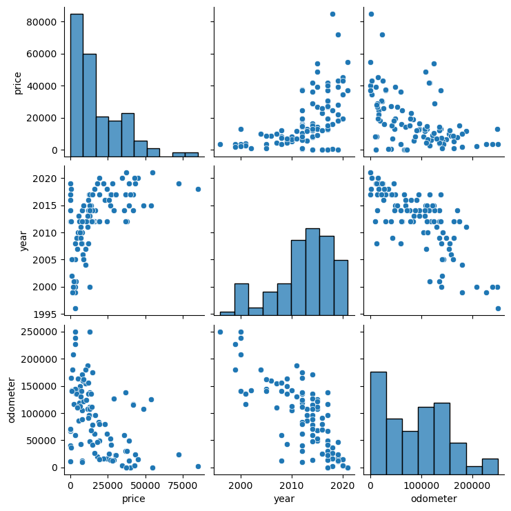
  <br>
  <em>Figure 1: Distribution of numerical values after initial cleaning.</em>
</p>

### Feature Engineering
*   **Log Transformation:** The raw price data was heavily right-skewed. A log transformation was applied to normalize the distribution, stabilizing variance and improving model performance.
*   **Encoding and Scaling:** Categorical variables were converted using Label Encoding. Large numerical features (odometer, year, model, region) were normalized to ensure model coefficients remained interpretable.

<p align="center">
  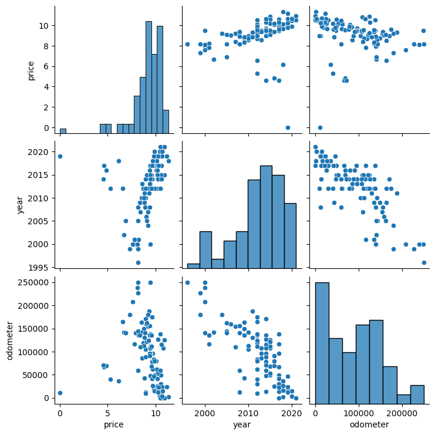
  <br>
  <em>Figure 2: Data distribution after Log Transformation.</em>
</p>

## Methods
This project approached the problem as a supervised regression task, implementing and comparing three distinct architectures:

1.  **Linear Regression:** Used as a baseline to determine linear relationships between vehicle attributes and price.
2.  **Feed-Forward Neural Network (Deep Learning):** A model utilizing three hidden layers (64, 32, and 16 neurons) with ReLU activation to capture non-linear complexities.
3.  **Random Forest Regressor:** An ensemble method utilizing 180 decision trees to reduce overfitting and handle the noisy nature of user-generated Craigslist data.

## Results and Discussion

### 1. Linear Regression
*   **R2 Score:** 62.37%

Linear Regression served as our baseline. While it captured general trends, the moderate R2 score suggests that the relationship between car features and price contains significant non-linearities that a simple line cannot capture.

<p align="center">
  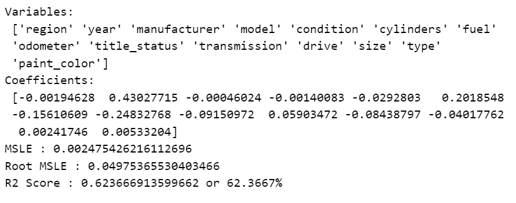
  <br>
  <em>Figure 3: Linear Regression Metrics.</em>
</p>

Feature importance analysis (Figure 4) confirmed intuition: **Year** and **Odometer** had the strongest impact on price. However, the model struggled to effectively weigh manufacturer and model distinctions.

<p align="center">
  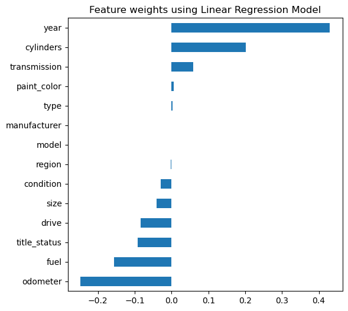
  <br>
  <em>Figure 4: Feature Weights (Linear Regression).</em>
</p>

<p align="center">
  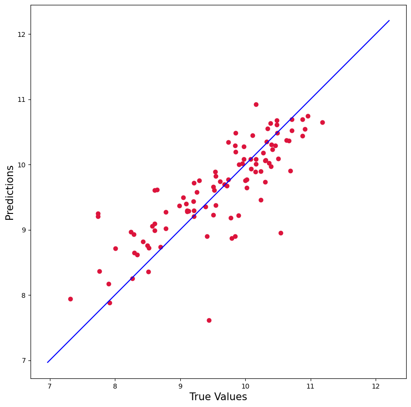
  <br>
  <em>Figure 5: Linear Regression - Predicted vs. True Price.</em>
</p>

### 2. Feed-Forward Neural Network
*   **R2 Score:** 76.88%

The Neural Network architecture was designed with a "funnel" structure (decreasing powers of 2) to gradually reduce dimensionality and learn hierarchical features.

<p align="center">
  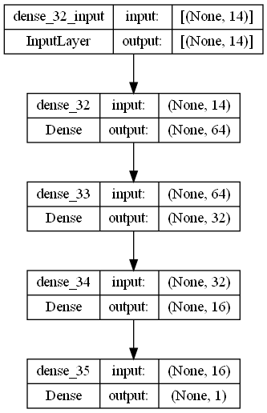
  <br>
  <em>Figure 6: Neural Network Architecture.</em>
</p>

The Deep Learning approach significantly outperformed the baseline, proving its ability to approximate the complex pricing function better than linear methods.

<p align="center">
  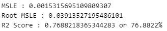
  <br>
  <em>Figure 7: Neural Network Metrics.</em>
</p>

<p align="center">
  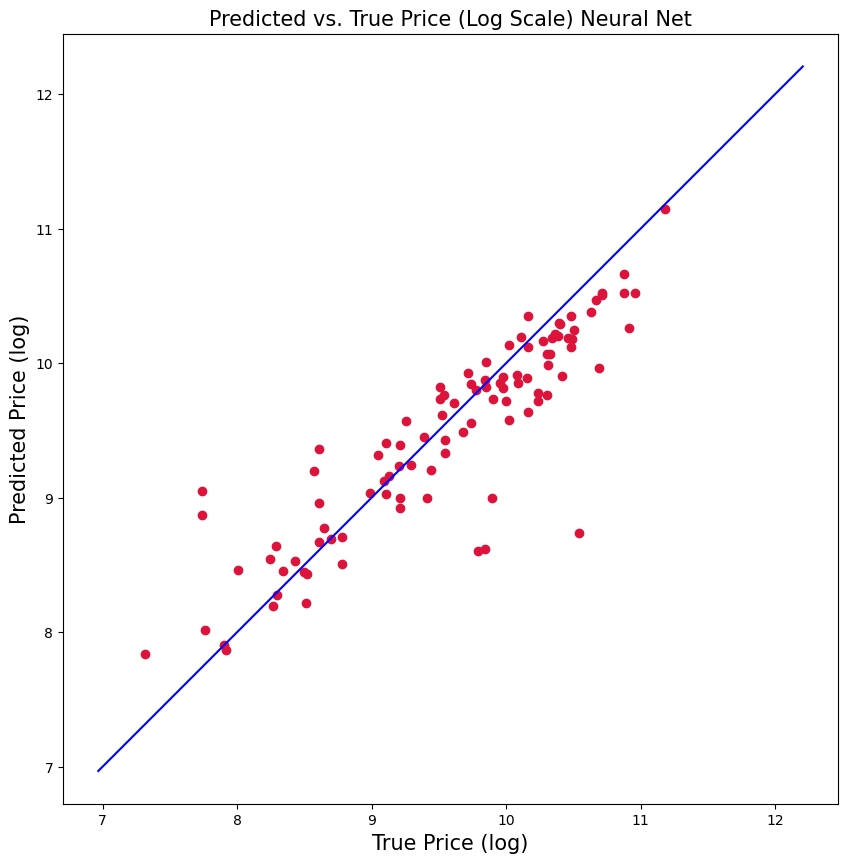
  <br>
  <em>Figure 8: Neural Network - Predicted vs. True Price.</em>
</p>

### 3. Random Forest Regressor (Best Performer)
*   **R2 Score:** 91.15%

The Random Forest model was the most effective, achieving a high degree of accuracy. By constructing 180 trees and sampling features at random, the model was robust to outliers and noise.

<p align="center">
  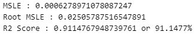
  <br>
  <em>Figure 9: Random Forest Metrics.</em>
</p>

As seen in Figure 10, the predictions cluster tightly along the diagonal, indicating high precision.

<p align="center">
  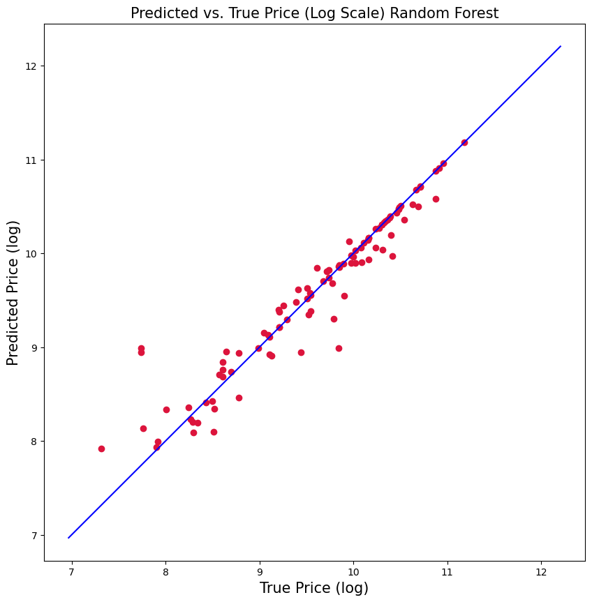
  <br>
  <em>Figure 10: Random Forest - Predicted vs. True Price.</em>
</p>

Variable importance analysis (Figure 11) shows that while Year and Odometer remain kings, the Random Forest was much better at utilizing the **Model** of the car as a pricing factor compared to Linear Regression.

<p align="center">
  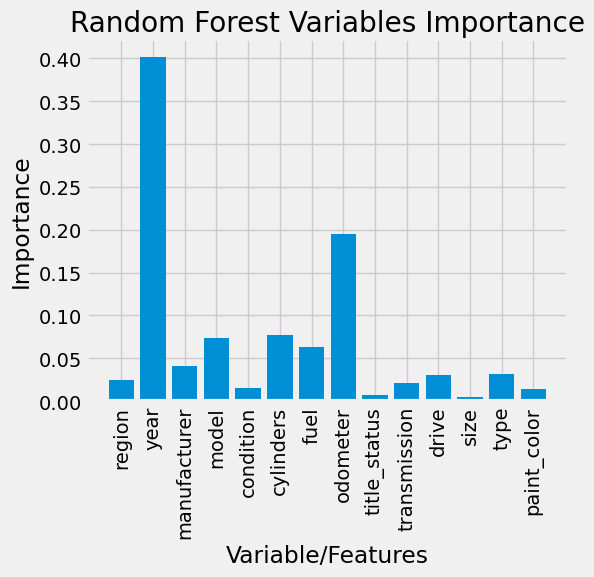
  <br>
  <em>Figure 11: Random Forest Variable Importance.</em>
</p>

## Future Improvements
*   **Hyperparameter Optimization:** Currently, parameters were tuned manually. Implementing Grid Search or Bayesian Optimization could further refine the Random Forest and Neural Network.
*   **Advanced Activation Functions:** Experimenting with Leaky ReLU or Tanh in the Neural Network could help the model generalize better to unseen data.
*   **Production Pipeline & Encoding Rigor:** To prevent data leakage in a strict production environment, the Label Encoders should be fit exclusively on training data and handle unknown categories in the test set gracefully. Furthermore, for the **Linear Regression and Neural Network** models, we plan to replace the current **Label Encoding** with **One-Hot Encoding (OHE)** for categorical features. This will remove the assumption of ordinality (i.e., that 'model B' is numerically greater than 'model A'), which is more appropriate for these models. The Random Forest model, being tree-based, is generally less sensitive to this specific encoding artifact.

## Usage

### 1. Setup
Clone the repository and install dependencies:
```bash
git clone https://github.com/AnandJha123456789/User-Car-Price-Predictor.git
cd used-car-price-predictor
pip install -r requirements.txt
```

### 2. Data
Download the dataset from [Kaggle](https://www.kaggle.com/datasets/austinreese/craigslist-carstrucks-data) and save it as `vehicles.csv` in the root directory.

### 3. Execution
**Step 1: Clean and Process Data**
```bash
python data_cleaning.py
```
*This script imputes missing values, removes outliers, and generates `processed_dataset.csv`.*

**Step 2: Generate Visualizations**
```bash
python visualization.py
```

**Step 3: Train and Evaluate Models**
```bash
python models.py
```
*This will train all three models and save performance metrics/plots to the `FinalReportImages` directory.*

## References
1. Varshitha, Janke, K. Jahnavi, and C. Lakshmi. "Prediction Of Used Car Prices Using Artificial Neural Networks And Machine Learning." 2022 International Conference on Computer Communication and Informatics (ICCCI). IEEE, 2022.
2. Schober, Patrick, and Thomas R Vetter. “Linear Regression in Medical Research.” Anesthesia and analgesia vol. 132,1 (2021): 108-109.
3. Baltas, G. and Saridakis, C. (2009), "Brand‐name effects, segment differences, and product characteristics: an integrated model of the car market", Journal of Product & Brand Management.

## License
[MIT License](LICENSE)